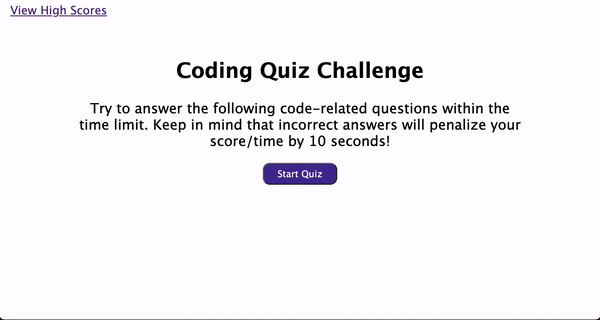

# code-quiz

## As a coding bootcamp student, 
I want to take a timed quiz on Javascript fundamentals that stores high scores so that I can guage my progress compared to my peers.

Working on this challenge will prepare me for upcoming interviews where it's likely that I'll be asked to complete a coding assessment. 

## Acceptance Criteria
- GIVEN I am taking a code quiz
- WHEN I click the start button
- THEN a timer starts and I am presented with a question
- WHEN I answer a question
- THEN I am presented with another question
- WHEN I answer a question incorrectly
- THEN time is subtracted from the clock
- WHEN all questions are answered or the timer reaches 0
- THEN the game is over
- WHEN the game is over
- THEN I can save my initials and score

## Technologies used:
This app features dynamically updated HTML and CSS powered by my Javascript code. 

## Demo 

## Deployed URL:
https://mals1230.github.io/code-quiz/
## GitHub repository URL:
https://github.com/mals1230/code-quiz
